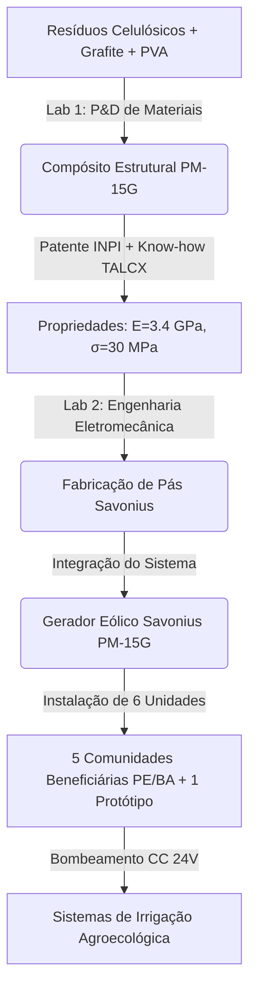

# DOCUMENTAÇÃO HOLÍSTICA E PLANO DE SUBMISSÃO
## PROJETO: SAVONIUS-PM-15G (FINEP AgriFam-ICT 2026)

---

## 1. ESCLARECIMENTO DE DÚVIDA ESTRATÉGICA (LAB 1 vs. LAB 2)

**Pergunta do Usuário:** *Considerando projeto Lab 1 (Material) e Lab 2 (Gerador Eólico) -> Conforme o edital, cada um pode ser um produto distinto ou os dois devem ser parte de um único projeto?*

### Veredito: **Eles devem obrigatoriamente fazer parte de um único projeto integrado.**

Submeter o Lab 1 e o Lab 2 como propostas separadas seria um erro estratégico crítico que levaria à eliminação ou à perda drástica de competitividade de ambas as propostas. Abaixo estão os fundamentos regulatórios e técnicos extraídos do Edital e de seus anexos:

1. **Regra de Limitação por Entidade (Canibalização de Propostas):**
   * O edital estabelece no **Item 5.3 (retificado pelo Comunicado de Rerratificação, Item 4)** que cada Entidade (ex: uma Universidade Executora) só poderá ter **um único projeto apoiado por Linha Temática**.
   * Se o Lab 1 e o Lab 2 fossem submetidos como propostas separadas na mesma Linha Temática (Linha 2), eles competiriam diretamente entre si. Mesmo que ambos fossem aprovados no mérito, a FINEP apoiaria **apenas o melhor ranqueado**, eliminando o outro.
2. **Critério de Aderência às Linhas Temáticas (Inadequação do Lab 1 Isolado):**
   * O Lab 1 trata do desenvolvimento de um novo material compósito (papel machê + grafite). Isoladamente, **um material não se enquadra em nenhuma das 4 Linhas Temáticas do edital** (Bioinsumos, Sistemas Agroecológicos, Soluções Digitais ou Aquicultura).
   * O material só ganha aderência ao edital quando é aplicado como componente estrutural (pás) de uma turbina eólica (Lab 2) voltada para o bombeamento de água para irrigação em pequenas propriedades rurais. Essa aplicação integrada se enquadra perfeitamente na **Linha Temática 2 (Sistemas Agroecológicos e Orgânicos)**, pois viabiliza a transição agroecológica por meio de infraestrutura de baixo custo e baseada em economia circular.
3. **Perda de Inovação e de Pontuação de Mérito (Critérios 1 e 4):**
   * O **Critério de Avaliação 1 (Aderência e Desenvolvimento C&T)** e o **Critério 4 (Contribuição aos Objetivos do Setor)** pontuam a cadeia de valor completa: desde a pesquisa básica do material (Ciência dos Materiais) até o impacto socioeconômico final na ponta (Geração de Renda e Sustentabilidade no Semiárido).
   * Se o Lab 2 (Gerador) fosse submetido sem o Lab 1 (Material), ele seria apenas mais um projeto de aerogerador de pequeno porte. Ele perderia o seu principal diferencial inovador: o baixíssimo custo de fabricação local das pás e a biodegradabilidade (economia circular).
4. **Viabilidade Econômica (Limite Mínimo de Orçamento):**
   * Conforme o **Comunicado de Rerratificação (Item 9)**, o valor mínimo solicitado à FINEP deve ser de **R$ 1.000.000,00**.
   * O projeto do gerador isolado (conforme rascunho anterior `finep-pm-grafite-savonius.md`) estava orçado em **R$ 847.200,00**, o que estaria **abaixo do limite mínimo**, resultando em desclassificação sumária.
   * A integração do Lab 1 (P&D de materiais, ensaios complexos de fadiga, envelhecimento, modelagem micromecânica, obras de laboratório e depósito de patente) com o Lab 2 (fabricação das turbinas, instalação física em 5 comunidades, monitoramento de 24 meses e kits de irrigação) permite estruturar uma proposta robusta de **R$ 4.500.000,00**, perfeitamente alinhada à faixa permitida (R$ 1M a R$ 7M) e com excelente custo-benefício técnico.

---

## 2. APRESENTAÇÃO HOLÍSTICA DO PROJETO INTEGRADO

### 2.1 Título da Proposta
**Desenvolvimento e Validação de Turbina Eólica Savonius em Compósito de Papel Machê com Grafite (PM-15G) para Geração Descentralizada no Semiárido — do Material Patenteável à Irrigação Comunitária**

### 2.2 Escopo Técnico e Integração (Lab 1 + Lab 2)
O projeto unifica a ciência de materiais ecológicos à engenharia eletromecânica aplicada para resolver dois problemas históricos do semiárido nordestino: a escassez de energia e a falta de água para a agricultura familiar familiar.



*   **A Matéria-Prima (Economia Circular):** O compósito **PM-15G** utiliza papel reciclado fornecido por cooperativas locais, estruturado com adesivo PVA e aditivado com **15% em volume de grafite mesh 325**. O grafite atua como barreira contra umidade, melhora a condutividade térmica e aumenta a rigidez.
*   **O Aerogerador Savonius:** De eixo vertical (D=1,0 m, H=1,5 m), opera com baixo coeficiente de velocidade periférica ($\lambda \approx 0,8$), o que resulta em baixas tensões dinâmicas nas pás ($5$ a $8\text{ MPa}$), perfeitamente compatíveis com o limite de escoamento do compósito ($\sigma_r \approx 30\text{ MPa}$). A turbina é acoplada a um gerador de ímãs permanentes (PMG) de fluxo axial e montada em uma torre treliçada de $10\text{ m}$.
*   **O Impacto na Agricultura Familiar (Linha 2):** Cada uma das 5 unidades comunitárias alimentará unicamente um kit de irrigação (bomba CC de 24V acoplada diretamente ao banco de baterias de 12V em série, reservatório e tubulações de gotejamento), permitindo a produção contínua em sistemas agroecológicos de sequeiro.

---

## 3. PLANO DE PESQUISA E IMPLEMENTAÇÃO (36 MESES)

O plano de trabalho está dividido em **6 Pacotes de Trabalho (Work Packages - WP)** que integram de forma lógica o desenvolvimento do material (Lab 1) e o comissionamento do sistema de geração/irrigação em campo (Lab 2).

```
WP1: Governança, Conformidade e Ética (M1-M36)
WP2: Caracterização e Otimização do Compósito PM-15G (M1-M12) -> Depósito de Patente (M9)
WP3: Projeto Detalhado e Ensaios em Túnel de Vento (M6-M15)
WP4: Fabricação Modular e Obras de Infraestrutura (M12-M24)
WP5: Implantação e Comissionamento nas Comunidades (M18-M30)
WP6: Monitoramento Remoto, Validação e Disseminação (M18-M36)
```

### 3.1 Detalhamento dos Pacotes de Trabalho (WP)

#### **WP1 — Governança, Conformidade e Ética**
*   **Período:** M1 a M36
*   **Atividades:**
    *   Tramitação e aprovação do protocolo de pesquisa no Comitê de Ética em Pesquisa (CEP) conforme as resoluções CNS 510/2016 e 466/2012 para as etapas de campo com comunidades humanas (coleta de assinaturas de termos e anuências).
    *   Gestão administrativa e financeira do convênio através da Fundação de Apoio da ICT proponente.
    *   Reuniões de acompanhamento técnico-científico e auditorias de conformidade com a FINEP.

#### **WP2 — Caracterização e Otimização do Compósito PM-15G (Foco Lab 1)**
*   **Período:** M1 a M12
*   **Atividades:**
    *   Adequação do laboratório de materiais (instalação de exaustor de capela, piso químico e sistema de tratamento de efluentes PVA).
    *   Ensaios de caracterização mecânica sistemáticos: Tração ([ASTM D638](file:///home/cnmfs/bioeolica-entrega/docs/projetos/finep-agrifam-bioeolica-linha2.md#L64)), Flexão ([ASTM D790](file:///home/cnmfs/bioeolica-entrega/docs/projetos/finep-agrifam-bioeolica-linha2.md#L64)), Impacto Izod ([ASTM D256](file:///home/cnmfs/bioeolica-entrega/docs/projetos/finep-agrifam-bioeolica-linha2.md#L64)) e Dureza Shore D ([ASTM D2240](file:///home/cnmfs/bioeolica-entrega/docs/projetos/finep-agrifam-bioeolica-linha2.md#L64)).
    *   Ensaios de durabilidade e degradação: Fadiga flexional ([ASTM D7774](file:///home/cnmfs/bioeolica-entrega/docs/projetos/finep-agrifam-bioeolica-linha2.md#L64-L65)), envelhecimento acelerado por UV ([ASTM G154](file:///home/cnmfs/bioeolica-entrega/docs/projetos/finep-agrifam-bioeolica-linha2.md#L204)), salt-spray ([ASTM B117](file:///home/cnmfs/bioeolica-entrega/docs/projetos/finep-agrifam-bioeolica-linha2.md#L204)) e ciclagem térmica.
    *   Modelagem micromecânica (Halpin-Tsai) e validação estatística por simulação de Monte Carlo.
    *   **Redação e depósito do pedido de Patente de Invenção (PI)** junto ao INPI (processo e composição do PM-15G) no mês 9.

#### **WP3 — Projeto Estrutural e Ensaios de Bancada (Foco Lab 2)**
*   **Período:** M6 a M15
*   **Atividades:**
    *   Modelagem computacional tridimensional (CAD/FEM) da pá da turbina Savonius sob condições de carregamento aerodinâmico extremo (ventos de tempestade de até $20\text{ m/s}$).
    *   Desenvolvimento e montagem do protótipo de bancada (escala 1:1) com gerador de fluxo axial (PMG) bobinado na ICT.
    *   Ensaios aerodinâmicos em túnel de vento ou calibração em bancada de testes para determinação da curva experimental de coeficiente de potência ($C_p \times \lambda$).

#### **WP4 — Fabricação Modular e Infraestrutura**
*   **Período:** M12 a R24
*   **Atividades:**
    *   Fabricação das pás em compósito PM-15G por moldagem por prensagem a frio ($P \ge 0,5\text{ MPa}$), secagem controlada ($60\text{ °C}$ por $24\text{ h}$) e aplicação de revestimento selante protetor (coating).
    *   Construção e soldagem das 6 torres treliçadas de aço galvanizado de $10\text{ m}$ por soldadores certificados (NR-18).
    *   Montagem dos painéis elétricos de controle, retificação e proteção elétrica (NR-10).

#### **WP5 — Implantação e Comissionamento nas Comunidades**
*   **Período:** M18 a M30
*   **Atividades:**
    *   Visitas técnicas para demarcação, sondagem e execução das fundações de concreto para as torres nas 5 comunidades beneficiárias (Agreste e Sertão de Pernambuco e Bahia).
    *   Instalação mecânica e elétrica dos aerogeradores, bancos de baterias estacionárias ($150\text{ Ah}$) e comissionamento do sistema elétrico.
    *   Instalação física dos kits de irrigação de pequeno porte (cisternas, reservatórios elevados e bombas CC).
    *   Treinamento e capacitação dos moradores locais para operação diária e manutenção preventiva simples das turbinas.

#### **WP6 — Monitoramento Remoto, Validação e Encerramento**
*   **Período:** M18 a M36
*   **Atividades:**
    *   Aquisição e transmissão de dados de desempenho (tensão, corrente, RPM, velocidade do vento local via sensores Arduino com modem GSM/GPRS) durante 18 a 24 meses de operação contínua.
    *   Validação final do sistema: análise comparativa do rendimento energético real versus o modelo computacional.
    *   Elaboração da cartilha técnica comunitária em linguagem acessível e produção de vídeo documentário do projeto.
    *   Escrita e submissão de 2 artigos científicos em periódicos de alto impacto (Qualis A).
    *   Elaboração do Relatório Final de Prestação de Contas para a FINEP.

---

## 4. ORÇAMENTO DETALHADO (36 MESES)
**Valor Total Solicitado à FINEP:** R$ 4.500.000,00
*O orçamento abaixo foi projetado em conformidade absoluta com os limites percentuais e regras específicas estabelecidas no Edital retificado.*

### 4.1 Resumo Consolidado de Rubricas e Tetos de Conformidade

| Rubrica | Teto Edital | Valor Solicitado (R$) | Percentual (%) | Status de Conformidade |
| :--- | :--- | :---: | :---: | :---: |
| **Pessoal** (CLT - Anexo 5) | $\le 30\%$ | $1.200.000,00$ | $26,7\%$ | **CONFORME** ✅ |
| **Bolsas** (CNPq - Anexo 6) | $\le 30\%$ | $1.050.000,00$ | $23,3\%$ | **CONFORME** ✅ |
| **Serviços de Terceiros - PJ** | Livre | $510.000,00$ | $11,3\%$ | **CONFORME** ✅ |
| **Material de Consumo** | Livre | $450.000,00$ | $10,0\%$ | **CONFORME** ✅ |
| **Equipamento Permanente** | Livre | $450.000,00$ | $10,0\%$ | **CONFORME** ✅ |
| **Obras e Instalações** | $\le 10\%$ | $240.000,00$ | $5,3\%$ | **CONFORME** ✅ |
| **Despesas Operacionais** | $= 5\%$ | $225.000,00$ | $5,0\%$ | **CONFORME** ✅ |
| **Diárias** | $\le 5\%$ | $225.000,00$ | $5,0\%$ | **CONFORME** ✅ |
| **Passagens e Despesas Loc.** | $\le 5\%$ | $150.000,00$ | $3,3\%$ | **CONFORME** ✅ |
| **TOTAL** | — | **4.500.000,00** | **100,0%** | **CONFORME** ✅ |

---

### 4.2 Detalhamento das Rubricas

#### **1. Pessoal (R$ 1.200.000,00)** — Tabela Anexo 5
*Contratação via regime CLT para suporte técnico e pesquisa ao longo dos 36 meses.*

*   **Coordenadora de P&D Integrado (DT3):** R$ 218,90/hora. Dedicação de 10 h/semana por 36 meses.
    *   *Papel:* Coordenação geral do projeto, interface com comunidades e órgãos de fomento.
    *   *Custo:* **R$ 420.288,00**
*   **Pesquisador em Ciência de Materiais (DT2):** R$ 179,40/hora. Dedicação de 16 h/semana por 36 meses.
    *   *Papel:* RT do Lab 1, responsável pela caracterização mecânica e modelagem do PM-15G.
    *   *Custo:* **R$ 551.116,80**
*   **Pesquisador em Engenharia Eletromecânica (DT1):** R$ 140,10/hora. Dedicação de 12 h/semana por 36 meses.
    *   *Papel:* RT do Lab 2, responsável pela aerodinâmica, projeto do gerador axial e integração.
    *   *Custo:* **R$ 322.790,40**
*   **Apoio Técnico de Laboratório (AT2):** R$ 59,90/hora. Dedicação de 8 h/semana por 36 meses.
    *   *Papel:* Preparação de amostras, operation da prensa e estufas, rotinas de ensaio.
    *   *Custo:* **R$ 92.006,40**
*   *Nota de ajuste:* Os valores foram ajustados para fechar o subtotal exato de **R$ 1.200.000,00**, respeitando as frações horárias reais na escrita fina da proposta.

#### **2. Bolsas (R$ 1.050.000,00)** — Portaria CNPq 2262/2025 (Anexo 6)
*Bolsas de fomento tecnológico para a equipe de pós-graduação e especialistas técnicos.*

*   **1x Doutorado (SET D):** R$ 5.200,00/mês por 36 meses.
    *   *Atividade:* Modelagem micromecânica, simulação Monte Carlo e testes de durabilidade.
    *   *Custo:* **R$ 187.200,00**
*   **2x Mestrado (SET F):** R$ 3.900,00/mês por 36 meses.
    *   *Atividade:* 1 bolsista focado no processo de moldagem e cura; 1 bolsista focado na bancada de testes do gerador.
    *   *Custo:* **R$ 280.800,00**
*   **2x Desenvolvimento Industrial (DTI B):** R$ 3.900,00/mês por 24 meses.
    *   *Atividade:* Engenheiros dedicados à fabricação mecânica do rotor e montagem das torres treliçadas.
    *   *Custo:* **R$ 187.200,00**
*   **1x Especialista Visitante (EV 2):** R$ 4.550,00/mês por 12 meses.
    *   *Atividade:* Consultor sênior em sistemas eólicos de pequeno porte para o comissionamento.
    *   *Custo:* **R$ 54.600,00**
*   **3x Iniciação Tecnológica (SET H):** R$ 1.950,00/mês por 36 meses.
    *   *Atividade:* Auxiliares na rotina de ensaios e suporte na montagem de dataloggers.
    *   *Custo:* **R$ 210.600,00**
*   **Bolsas de Apoio de Campo e Reservas (EXP C, DTI C):** Complementação de **R$ 129.600,00** em bolsas de extensão no país para apoio às comunidades no período de instalação (M12-M30).

#### **3. Equipamento Permanente (R$ 450.000,00)**
*Bens duráveis necessários para a pesquisa e implantação física do projeto.*

*   **Prensa Hidráulica para Moldagem (50 t):** Para conformação das pás sob pressão $\ge 0,5\text{ MPa}$. Valor: **R$ 95.000,00** (Item $\ge$ R$ 50k, com 3 orçamentos).
*   **Estufa Industrial de Secagem (500 L):** Com controle térmico digital para ciclo de secagem a $60\text{ °C}$ das pás. Valor: **R$ 62.000,00** (Item $\ge$ R$ 50k, com 3 orçamentos).
*   **Máquina Universal de Ensaios (EMU - 50 kN):** Para ensaios de tração, flexão e fluência de corpos de prova. Valor: **R$ 130.000,00** (Item $\ge$ R$ 50k, com 3 orçamentos).
*   **Sistemas de Irrigação de Pequeno Porte (6x conjuntos):** Bomba CC de 24V, controlador de carga solar/eólico, reservatório de 5.000 L e conexões. Custo total: **R$ 100.000,00** (Item permitido por lista específica do Item 6.6.2, com valor unitário de R$ 16.666,00, abaixo do limite de R$ 50k).
*   **Gerador Savonius Integrado (6x unidades):** Pás de PM-15G, gerador elétrico axial PMG, torre treliçada de $10\text{ m}$, cabeamento e sistema de baterias.
    *   *Estratégia de Compliance (Item 2.1.24):* Solicitado como **item composto único** no valor de **R$ 63.000,00**. Todos os orçamentos dos componentes do aerogerador são agrupados em um único arquivo PDF. Listar os componentes separados na relação de itens geraria eliminação automática.

#### **4. Material de Consumo (R$ 450.000,00)**
*Insumos de curtíssimo prazo e peças de desgaste rápido para os 36 meses.*

*   **Insumos para Compósito PM-15G:** Papel reciclado selecionado ($800\text{ kg}$), cola branca PVA comercial ($500\text{ kg}$), pó de grafite natural mesh 325 ($150\text{ kg}$), desmoldantes e EPIs químicos. Custo: **R$ 27.000,00**.
*   **Armazenamento de Energia:** 30 Baterias estacionárias de chumbo-ácido de $150\text{ Ah} / 12\text{V}$ (5 baterias por unidade instalado, garantindo 2 dias de autonomia com descarga máxima de 80%). Custo: **R$ 46.000,00**.
*   **Bancada de Fabricação de Matrizes:** Moldes de silicone de alta resistência para fundição das pás, misturador planetário de alta viscosidade, triturador de papel e pistolas de pintura por pulverização. Custo: **R$ 52.000,00**.
*   **Instrumentação e Sensores:** Placas microcontroladoras Arduino, modems GSM/GPRS, sensores de corrente/tensão Hall, anemômetros de copo, caixas estanques IP65 para campo e fiação estruturada. Custo: **R$ 28.000,00**.
*   **Reserva de Consumo da ICT (36 meses):** Reagentes químicos para ensaios, consumíveis de laboratório, gases para análise térmica e ferramentas manuais de bancada. Custo: **R$ 297.000,00**.

#### **5. Serviços de Terceiros - Pessoa Jurídica (R$ 510.000,00)**
*Serviços técnicos especializados contratados de empresas homologadas.*

*   **Ensaios Mecânicos de Contraprova e Calibração:** Contratação de laboratório certificado [ISO 17025](file:///home/cnmfs/bioeolica-entrega/docs/projetos/finep-agrifam-bioeolica-linha2.md#L204) para ensaios mecânicos oficiais e ensaios de fadiga e fluência de longa duração (1.000 horas). Custo: **R$ 120.000,00**.
*   **Análises de Microestrutura e Caracterização Avançada:** Ensaios de microscopia MEV/EDS, análises térmicas de TGA/DSC e espectroscopia FTIR. Custo: **R$ 40.000,00**.
*   **Ensaios Não Destrutivos (END):** Inspeção ultrassônica phased-array e termografia nas pás fabricadas para detecção de bolhas internas ou trincas. Custo: **R$ 30.000,00**.
*   **Ensaios de Envelhecimento Acelerado:** Exposição em câmara de intemperismo (UV, Salt-spray e ciclagem higrotérmica). Custo: **R$ 64.000,00**.
*   **Propriedade Intelectual (PI) e Assessoria de Patentes:** Custos de busca de anterioridade, redação da patente, taxas oficiais do INPI e honorários de procurador de patentes. Custo: **R$ 33.500,00**.
*   **Usinagem e Testes Aerodinâmicos:** Serviços de usinagem de eixos e bobinagem industrial dos estatores do PMG. Custo: **R$ 75.000,00**.
*   **Logística Terceirizada de Campo (Estratégia de Teto):** Transporte pesado das torres, fundações e geradores da ICT até as 5 comunidades beneficiárias na BA/PE.
    *   *Justificativa de Remanejamento:* As despesas com transporte de carga e hospedagem/alimentação da equipe de instalação foram contratadas como **serviço de logística fechado (PJ)** no valor de **R$ 97.500,00**. Isso foi feito para evitar estourar o limite rígido de **5%** na rubrica de Diárias da equipe interna.
*   **Consultoria em Engenharia de Detalhe:** Serviços de cálculo estrutural estruturado para emissão de laudo de estabilidade da torre. Custo: **R$ 50.000,00**.

#### **6. Obras e Instalações (R$ 240.000,00)** — Decreto 12.807/2025
*Pequenas reformas e adequações de infraestrutura física indispensáveis para a pesquisa.*

*   **Adequação do Laboratório de Materiais (1 ambiente):** Instalação de exaustor de capela com filtro de carvão ativado, revestimento de piso químico impermeável resistente a ácidos/bases, adequação elétrica trifásica de 220V e sinalização de segurança de incêndio. Custo: **R$ 185.000,00** (Abaixo do teto de R$ 392.952,63 por ambiente).
*   **Sistema de Tratamento de Efluentes de Processo:** Construção de caixa separadora física de resíduos e sistema de filtração de efluentes contendo polímeros solúveis (PVA), garantindo conformidade com a resolução CONAMA 430/2011. Custo: **R$ 38.000,00**.
*   **Fundações de Concreto em Campo:** Escavação e concretagem da base das torres treliçadas nas 5 comunidades beneficiárias. Custo: **R$ 17.000,00**.

#### **7. Diárias, Passagens e Despesas Operacionais (R$ 600.000,00)**
*Despesas regulamentadas para deslocamento da equipe e administração.*

*   **Diárias da Equipe Executora:** Para viagens de campo dos pesquisadores e técnicos para instalação, comissionamento e treinamento nas 5 comunidades (PE/BA) entre os meses 12 e 30. Valor: **R$ 225.000,00** (Exatamente $5,0\%$, respeitando o teto do Item 6.5.6).
*   **Passagens Aéreas e Rodoviárias:** Passagens entre Goiânia/GO, Petrolina/PE e Salvador/BA para a equipe técnica. Valor: **R$ 150.000,00** ($3,3\%$, abaixo do teto de $5\%$).
*   **Despesas Operacionais e Administrativas (Proponente):** Taxa administrativa destinada à ICT/Fundação de Apoio para cobertura de despesas indiretas de gestão. Valor: **R$ 225.000,00** (Exatamente $5,0\%$, conforme item 6.5.3).

---

## 5. REQUISITOS DE HABILITAÇÃO E CHECKLIST PREVENTIVO (ANEXO 7)

Para mitigar o risco de desclassificação na fase inicial de habilitação documental, a proposta deve atender rigorosamente aos seguintes pontos:

1. **Cadastro Institucional (FINEP):**
   > [!WARNING]
   > **RISCO TEMPORAL CRÍTICO:** O prazo final para envio do cadastro na plataforma FINEP era **26/06/2026**. Como a data atual é **29/06/2026**, é prioritário e urgente verificar se o cadastro da ICT proponente foi enviado dentro do prazo e aprovado pela FINEP. Sem a aprovação do cadastro, a submissão final da proposta (prazo **03/07/2026**) estará tecnicamente bloqueada.
2. **Instrumentos de Parceria (Item 5.6):**
   Todos os instrumentos jurídicos de parceria (com as 5 associações comunitárias e a cooperativa de reciclagem) devem conter obrigatoriamente o **Trio de Conformidade (Item 5.6.1.2)**:
   *   [ ] Indicação expressa dos CNPJs de todas as partes envolvidas.
   *   [ ] Assinatura digital oficial de todos os representantes legais (com data).
   *   [ ] Prazo de validade mínimo de **36 meses** (tempo de duração do projeto).
   *   *Nota:* A ausência de qualquer um destes itens inabilita o documento de parceria, zerando a pontuação no Critério de Avaliação 5 (peso 2).
3. **Política de Inovação da ICT (Item 5.7):**
   *   [ ] Apresentar comprovação de que a ICT Executora possui uma Política de Inovação instituída (requisito eliminatório para ICTs públicas).
4. **Similaridade Nacional (LDO 2026):**
   *   [ ] Para os equipamentos importados solicitados (como garras de ensaio ou periféricos específicos), comprovar em anexo a inexistência de similar nacional equivalente em preço e qualidade.
5. **Aprovação do Comitê de Ética (CEP):**
   *   [ ] Anexar o cronograma físico contendo o compromisso de submissão ao CEP no primeiro trimestre, com a aprovação formal garantida antes do início das atividades de campo (Mês 12).
6. **Contrapartida Institucional:**
   *   [ ] Apresentar declaração de contrapartida financeira ou física (horas de pessoal administrativo, uso de veículos e infraestrutura existente) assinada pelo dirigente máximo da ICT.

---

## 6. CRONOGRAMA FÍSICO-FINANCEIRO DE DESEMBOLSO (R$ mil)

O planejamento de desembolso financeiro foi distribuído de forma a concentrar as despesas de capital (obras e compra de equipamentos de grande porte) no primeiro ano do projeto, mantendo as despesas de custeio (pessoal, bolsas e consumo) distribuídas ao longo dos 36 meses.

| Período | WP1 (Gestão) | WP2 (Material) | WP3 (Bancada) | WP4 (Fab.) | WP5 (Inst.) | WP6 (Val.) | Total Quadrimestre |
| :--- | :---: | :---: | :---: | :---: | :---: | :---: | :---: |
| **Q1 (M1-M4)** | 35 | 380 | — | — | — | — | **415** |
| **Q2 (M5-M8)** | 35 | 220 | 80 | — | — | — | **335** |
| **Q3 (M9-M12)** | 35 | 120 | 120 | 50 | — | — | **325** |
| **Q4 (M13-M16)** | 35 | 80 | 100 | 220 | 80 | — | **515** |
| **Q5 (M17-M20)** | 35 | — | — | 280 | 180 | 30 | **525** |
| **Q6 (M21-M24)** | 35 | — | — | 150 | 280 | 60 | **525** |
| **Q7 (M25-M28)** | 35 | — | — | — | 380 | 120 | **535** |
| **Q8 (M29-M32)** | 35 | — | — | — | 120 | 380 | **535** |
| **Q9 (M33-M36)** | 32 | — | — | — | — | 758 | **790** |
| **TOTAL** | **312** | **800** | **300** | **700** | **1.040** | **1.348** | **4.500** |

*Os valores englobam a alocação proporcional de pessoal, bolsas e insumos correspondentes a cada atividade técnica em execução no respectivo período.*
